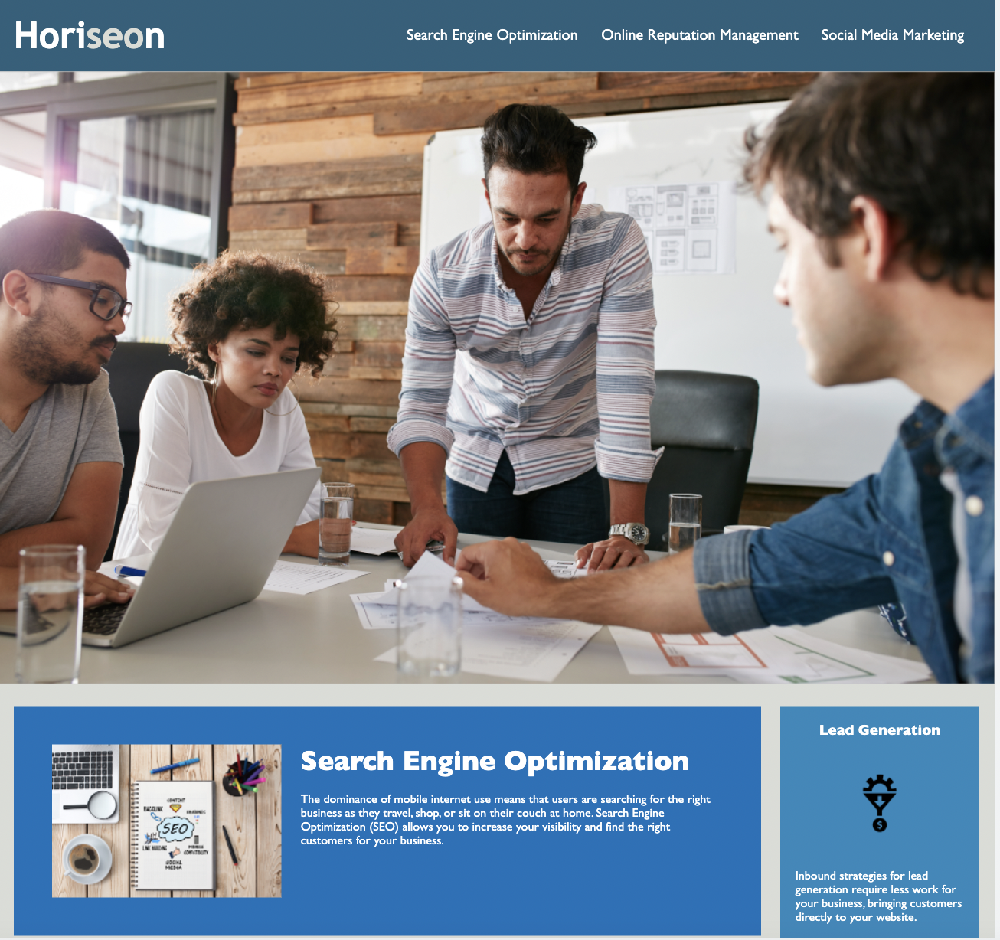
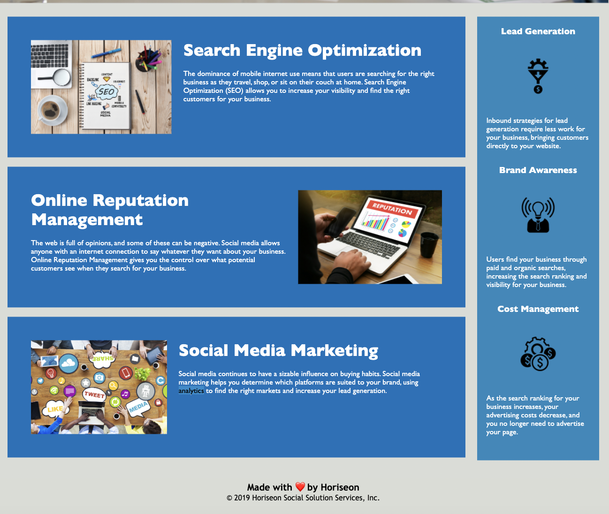

# User Story: Improve Accessibility Standards for Existing Website 

The client, marketing agency wants a codebase that follows accessibility standards.
As a developer 	:woman_technologist:, a site that is **optimized** for search engines is created.

## Acceptance Criteria 

The webpage meets **accessibility** standards as requested by the marketing agency:

*WHEN I view the source code
THEN I find **semantic** HTML elements

*WHEN I view the structure of the HTML elements
THEN I find that the elements follow a **logical structure** independent of styling and positioning

*WHEN I view the image elements
THEN I find **accessible alt attributes**

*WHEN I view the heading attributes
THEN they fall in **sequential order**

*WHEN I view the title element
THEN I find a **concise, descriptive title**

### Assets 

These images demonstrates the design of the website:

#### Credits

Code from MSU Git Lab Repository. 2022.
